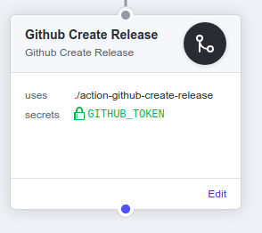

# Github Create Release Action

[](https://wdp9fww0r9.execute-api.us-west-2.amazonaws.com/production/results/frankjuniorr/github-create-release-action)
[](https://GitHub.com/frankjuniorr/github-create-release-action/releases/)

GitHub Action to create GitHub Release automatically.

<p align="center">
  
</p>

# Example Usage

```hcl
workflow "Deploy Release" {
  on = "push"
  resolves = [" Github Create Release"]
}

action "Filters for Master branch" {
  uses = "actions/bin/filter@master"
  args = "branch master"
}

action " Github Create Release" {
  uses = "frankjuniorr/github-create-release-action@master
  needs = ["Filters for Master branch"]
  secrets = ["GITHUB_TOKEN"]
}

```

In this case above, the Action only triggered if branch was ``master``

# Environment Variables

Optional, but if you pass the env var ``VERSION``, the action will create a git tag with this value. Same thing with the var ``DESCRIPTION``, if you pass, the release will be created with this description, otherwise, the release' description will be a last commit

## License

```
    Copyright 2019 Frank Junior
    ----------------------------------------------------------------------------
    "THE BEERWARE LICENSE" (Revision 42):
    <frankcbjunior@gmail.com> wrote this file. As long as you retain this notice you
    can do whatever you want with this stuff. If we meet some day, and you think
    this stuff is worth it, you can buy me a beer in return Frank Junior.
    ----------------------------------------------------------------------------
```


```
Copyright 2019 Frank Junior

    Licensed under the Apache License, Version 2.0 (the "License");
    you may not use this file except in compliance with the License.
    You may obtain a copy of the License at

       http://www.apache.org/licenses/LICENSE-2.0

    Unless required by applicable law or agreed to in writing, software
    distributed under the License is distributed on an "AS IS" BASIS,
    WITHOUT WARRANTIES OR CONDITIONS OF ANY KIND, either express or implied.
    See the License for the specific language governing permissions and
    limitations under the License.
```
